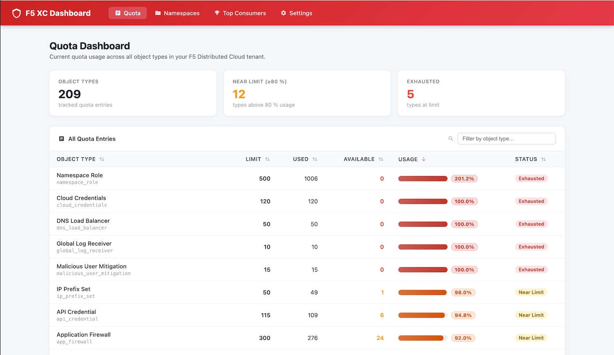
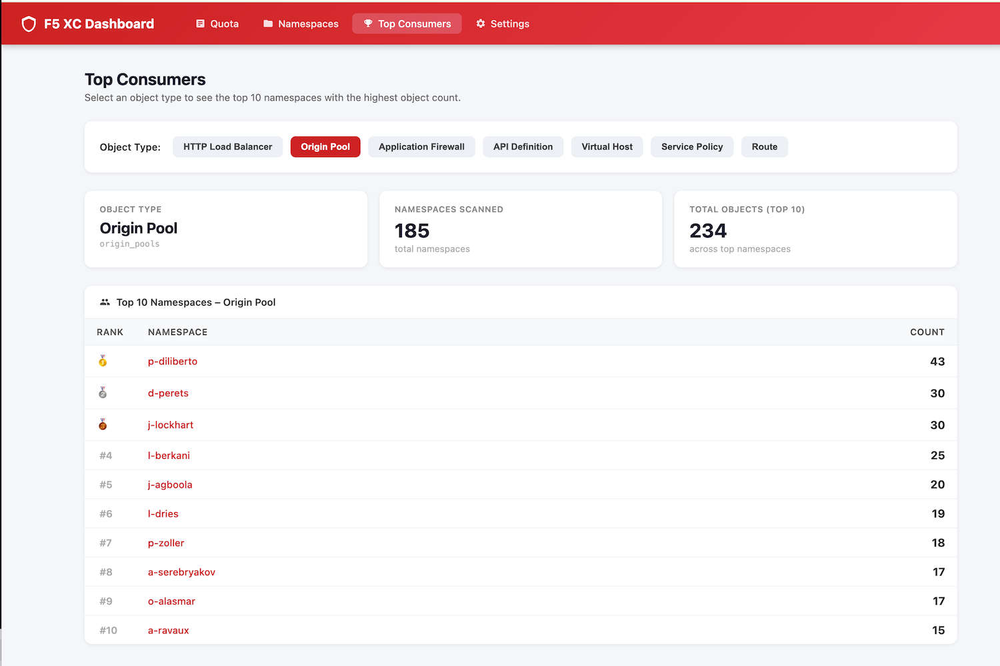
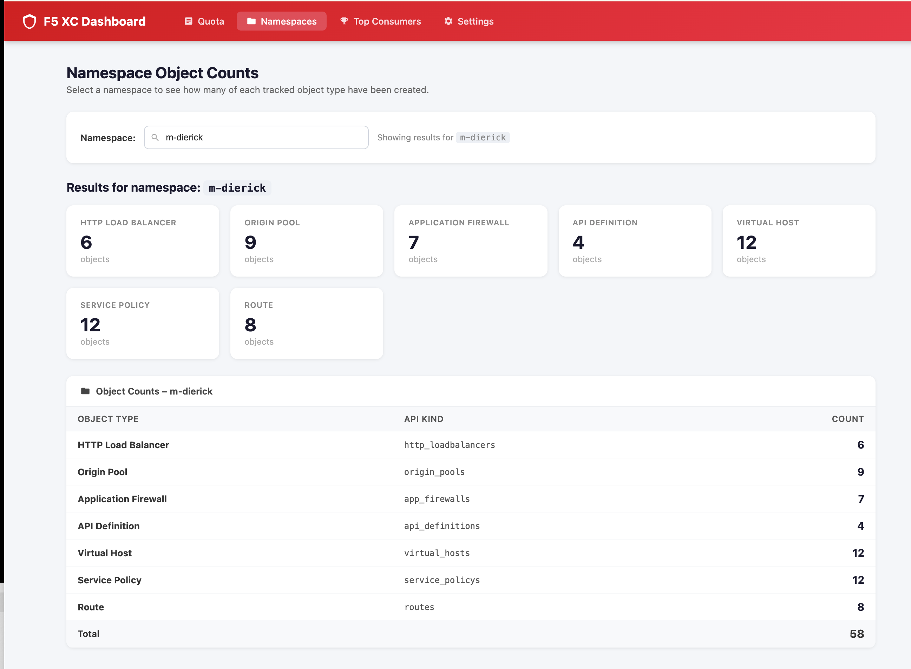

# F5 Distributed Cloud Dashboard

A web dashboard for viewing F5 Distributed Cloud resources — quota usage, namespace objects, and more.







## Running with Docker

### Pull the image

```bash
docker pull ghcr.io/mattdierick/f5xc-dashboard:latest
```

### Run the container

```bash
docker run -d \
  --name f5xc-dashboard \
  -p 8080:80 \
  -e F5_XC_TENANT=your-tenant \
  -e F5_XC_API_TOKEN=your-api-token \
  ghcr.io/mattdierick/f5xc-dashboard:latest
```

The dashboard will be available at [http://localhost:8080](http://localhost:8080).

### Environment variables

| Variable | Required | Default | Description |
|---|---|---|---|
| `F5_XC_TENANT` | Yes | — | Your F5 XC tenant subdomain (e.g. `acme` for `acme.console.ves.volterra.io`) |
| `F5_XC_API_TOKEN` | Yes | — | F5 XC API token |
| `F5_XC_DEFAULT_NAMESPACE` | No | `default` | Default namespace to query |
| `F5_XC_TIMEOUT_SECONDS` | No | `30` | HTTP timeout for API calls (seconds) |

> **Note:** Tenant and API token can also be configured through the Settings page in the web UI after startup.

### Using an env file

Create a `.env` file:

```env
F5_XC_TENANT=your-tenant
F5_XC_API_TOKEN=your-api-token
F5_XC_DEFAULT_NAMESPACE=default
F5_XC_TIMEOUT_SECONDS=30
```

Then pass it to `docker run`:

```bash
docker run -d \
  --name f5xc-dashboard \
  -p 8080:80 \
  --env-file .env \
  ghcr.io/mattdierick/f5xc-dashboard:latest
```

### Docker Compose

```yaml
services:
  f5xc-dashboard:
    image: ghcr.io/mattdierick/f5xc-dashboard:latest
    ports:
      - "8080:80"
    environment:
      F5_XC_TENANT: your-tenant
      F5_XC_API_TOKEN: your-api-token
      F5_XC_DEFAULT_NAMESPACE: default
      F5_XC_TIMEOUT_SECONDS: 30
    restart: unless-stopped
```

Start with:

```bash
docker compose up -d
```

## Authentication

The dashboard connects to the F5 Distributed Cloud API using an **API Token**.

To generate a token:
1. Log in to your F5 XC console at `https://<tenant>.console.ves.volterra.io`
2. Navigate to **Administration > Personal Management > Credentials**
3. Create a new API token and copy it

## Development

### Requirements

- Python 3.11+

### Install dependencies

```bash
pip install -e ".[dev]"
```

### Run locally

```bash
uvicorn app.main:app --reload --port 8080
```

### Lint and test

```bash
ruff check .
pytest -q
```
